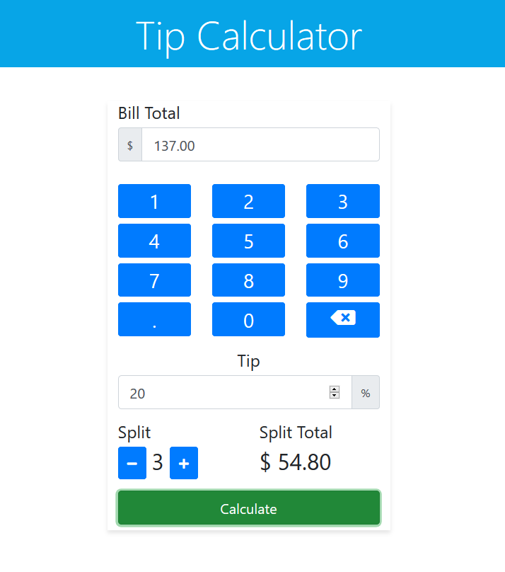

# Interactive Tip Calculator and Bill Splitter

> Simple interactive tip calculator and splitter. Check it out here [Live Demo](https://muzhaqi16.github.io/2020-04-01-Interactive-Calculator/)
> This project was build as part of mini hackathon held by [Mintbean](https://mintbean.io/scores/artanmuzhaqi@gmail.com)

**Screenshot**



## Technologies Used

- HTML, CSS
- Bootstrap
- jQuery

## Features

- Calculate custom tip percentage
- Split the bill as many ways as you like
**Demo**


## How to use it:

- Clone this repo to your local machine using ```git clone https://github.com/muzhaqi16/2020-04-01-Interactive-Calculator.git```
- ```cd``` into ```2020-04-01-Interactive-Calculator```
- Open index.html with your favourite browser

---

## Contributing

> I would love your contribution at making this repo better and adding new features. 
> To get started at contributing at this repo follow the steps below...

### Step 1

- **Option 1**
    - 🍴 Fork this repo!

- **Option 2**
    - 👯 Clone this repo to your local machine using `https://github.com/muzhaqi16/2020-04-01-Interactive-Calculator.git`

### Step 2

- **HACK AWAY!** 🔨🔨🔨

### Step 3

- 🔃 Create a new pull request using <a href="hhttps://github.com/muzhaqi16/2020-04-01-Interactive-Calculator/compare" target="_blank">`https://github.com/muzhaqi16/2020-04-01-Interactive-Calculator/compare`</a>.

---

## License

[](http://badges.mit-license.org)

- **[MIT license](http://opensource.org/licenses/mit-license.php)**
- Copyright 2020 © <a href="http://muzhaqi.com" target="_blank">Artan Muzhaqi</a>.
